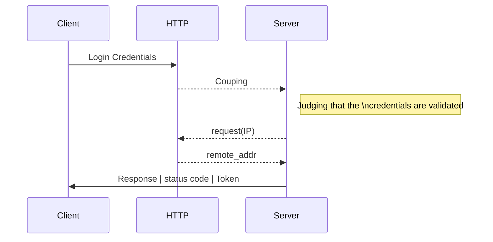
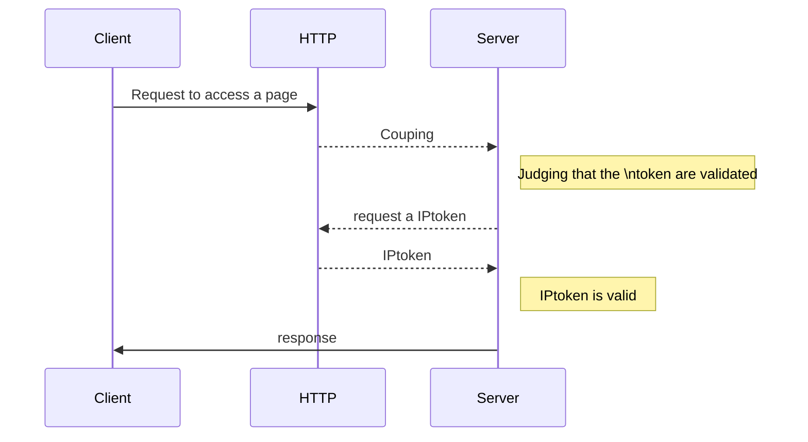

### Summary
- [How the IPT Token works](https://github.com/romuro-pauliv/IPT-Token/blob/main/docs/md/IPT-Token-works.md)
- [Generate Token]()
    - [Structure and Encryption](https://github.com/romuro-pauliv/IPT-Token/blob/main/docs/md/IPT-Token-works.md#structure-and-encryption)
    - [HTTP packet IP requirement](https://github.com/romuro-pauliv/IPT-Token/blob/main/docs/md/IPT-Token-works.md#http-packet-ip-requirement)
    - [Function parameters](https://github.com/romuro-pauliv/IPT-Token/blob/main/docs/md/IPT-Token-works.md#function-parameters)
- [Required Token]()
    - [Structure and Decryption]()
    - [Remote address validation]()
    - [Function parameters]()

## How the IPT Token works

The IPT Token generates a token based on the `SECRET_KEY` of a Flask application by concatenating the IP address of the HTTP packet sent in the `POST` method into a specific route. The token will be sent in the server's HTTP response packet in the header. For this reason, your route response must follow the parameters set for `@generate_token()` to work correctly.

The `@generate_token()` decorator will not interfere with the structure of your response. Regardless of whether it is an HTML rendering or a json application. The only object that will interfere is the HTTP packet header.



For routes that will require authentication by token, it is necessary to include the `@required_token()` decorator. This will change the response of your route function it the token is invalid or expired.



---
## Generate Token

#### Structure and Encryption

When starting a Flask application it is necessary to set the `SECRET_KEY` in the internal instance of the application. The IPT Token extension will request in the `current_app.config` instance the base key of the encryption. 

> (1) App config
```Python
def create_app() -> Flask:
    app = Flask(__name__, instance_relative_config=True)
    app.config.from_mapping(SECRET_KEY="<your .env import our random key string>")

    # ...

    return app
```

After setting the key in the configuration instance, you will be able to use the decorators. You can view the [quickstart]() module to see the application of the decorators at a glance. 

The structure of the decorator follows the parameterization bellow:

> (2) Decorator structure
```Python
class IPToken(object):
    @staticmethod
    def generate_token(...):
        def inner(func: Callable[..., tuple[Any, int]]) -> Callable[..., Union[tuple[Any, int], tuple[Any, int, dict]]]:
            @wraps(func)
            def wrapper(*args, **kwargs) -> Union[tuple[Any, int], tuple[Any, int, dict]]:
                # |----------------|
                # | Assemble Token |
                # |----------------|
                return func(*args, **kwargs), {"IPToken": token}
            return wrapper
        return inner
```

---

#### HTTP packet IP requirement

When assembling the token, the IP address of the received packet will be requested and concatenated in a dictionary to add to the JWT payload.

> (3) Token encode
```Python
# assemble header 
encode_header: dict[str, Union[str, datetime.datetime]] = {
    "ip": request.remote_addr,
    'exp': datetime.datetime.utcnow() + datetime.timedelta(minutes=exp)
}
encode_header.update(header_arguments)

# token encode
token: str = jwt.encode(payload=encode_header,
                        key=current_app.config["SECRET_KEY"],
                        algorithm=algorithm
)
```

The (3) code block will be wrapped by the `status_code` argument check function, giving the programmer freedom to structure his route response in any way.

> (4) Check condition
```Python
def wrapper(*args, **kwargs) -> Union[tuple[Any, int], tuple[Any, int, dict]]:
    func_value: tuple[Any, int] = func(*args, **kwargs)
    if func_value[1] == status_code:
        # |------------------|
        # | (3) Token encode |
        # |------------------|
        return func_value[0], func_value[1], {"IPToken": token}
    return func_value
```

Basically, the operation of the `@generate_token()` decorator condition is:

#### Function parameters

In the above structures there are parameters not yet defined in the documentation. Each parameter can be modified by the end programmer to best suit their application.

#### `@generate_token()`

| Parameter | Description | Format |
|-----------|-------------|--------|
| __status_code__ | Status code that will release the token generation | `int` |
| __exp__ | Validity time of the token (minutes). Defaults to 60 | Optional: `int` |
| __algorithm__ | Symmetric keyed hashing algorithm. Defaults to `HS256` | Optional: `str` |
| __header_arguments__ | Additional arguments you want to add inside the token to be encrypted. Defaults to {} | Optional: `dict[str, Any]` |

---

## Required Token

#### Structure and Decryption

The structure of the decorator is similar to the `@generate_token()` decorator where it is possible to set parameters for the decorator.

> (5) Decorator structure
```Python
class IPToken(object):
    def required_token(...):
        def inner(func: Callable[..., tuple[Any, int]]) -> Callable[..., Union[tuple[Any, int], tuple[Any, int, dict]]]:
            @wraps(func)
            def wrapper(*args, **kwargs) -> Union[tuple[Any, int], tuple[Any, int, dict]]:
                # |-------------------------------------|
                # | Decrypt and validation of the Token |
                # |-------------------------------------|
                return func(*args, **kwargs)
            return wrapper
        return inner
```

Validation is done after decryption the token with the `SECRET_KEY` of the Flask application. Therefore, we created a `token_validation()` function:

> (6) Decryption Token
```Python
# Split token string
try:
    try:
        token: str = token.split()[1]
    except IndexError:
        return "BAD REQUEST - TOKEN", HTTP_400_BAD_REQUEST
except AttributeError:
    return "BAD REQUEST - TOKEN NOT INFORMED", HTTP_400_BAD_REQUEST
 # Decode token 
try:
    try:
        decode_token: dict[str, Any] = jwt.decode(
            token,
            current_app.config['SECRET_KEY'],
            algorithms=algorithm
            )
    except jwt.exceptions.DecodeError:
        return "INVALID TOKEN", HTTP_400_BAD_REQUEST
except jwt.exceptions.ExpiredSignatureError:
    return "EXPIRED TOKEN", HTTP_403_FORBIDDEN

if decode_token['ip'] != request.remote_addr:
    return "IP ADDRESS DOES NOT MATCH", HTTP_403_FORBIDDEN

return "VALID TOKEN", HTTP_200_OK
```
---

#### Remote address validation

With the token data decrypted, it is possible to request the remote address of the packet and compare it with the one registered in the token.

> (7) Token Validation
```Python
token: str = request.headers.get("Authorization")
token_auth: tuple[str, int] = token_authentication(token, algorithm)
return token_auth if token_auth[1] != HTTP_200_OK else func(*args, **kwargs)
```

----

#### Function parameters

If you have the encryption algorithm in the `@generate_token()` you must change to the same algorithm in the `@required_token()` decorator.

#### `@required_token()`

| Parameter | Description | Format |
|-----------|-------------|--------|
| __algorithm__ | Symmetric keyed hashing algorithm. Defaults to `['HS256']` | Optional:`list[str]` |